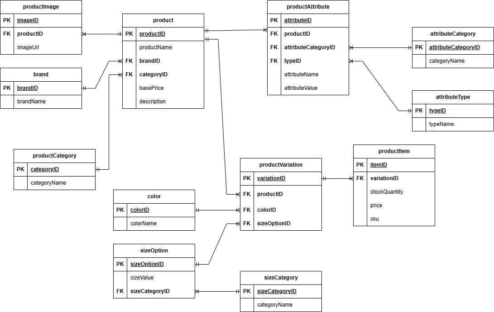

# 🛍️ E-commerce Database Design

Welcome to our **E-commerce Database Design Project**! This repository contains an Entity-Relationship Diagram (ERD) and a fully normalized relational database schema for a scalable e-commerce platform.

## 🎯 Objective

The goal of this project is to master database design principles by collaboratively analyzing, designing, and building a relational database for an e-commerce system.


## 🔄 Data Flow Overview

Products in this platform are created under specific **brands** and **categories**. Each product can have multiple **variations** (e.g., size, color), represented as purchasable **product items**. Additional product details like images and custom attributes (e.g., material, weight) are captured through relational tables.

## 📐E-commerce Database Entity-Relationship Diagram (ERD)



## 🗃️ Database Tables

Here’s a breakdown of the main tables and their purposes:

| Table Name           | Description |
|----------------------|-------------|
| `brand`              | Stores brand information |
| `productCategory`   | Classifies products into categories |
| `product`            | Stores general product details |
| `productImage`      | Stores product image URLs |
| `color`              | Manages available color options |
| `productVariation`  | Links a product to its specific variations |
| `productItem`       | Represents specific stock-keeping units (SKUs) |
| `sizeCategory`      | Groups size types (e.g., clothing, shoes) |
| `sizeOption`        | Lists specific size values |
| `attributeCategory` | Groups attributes into categories |
| `attributeType`     | Defines data type of attributes |
| `productAttribute`  | Stores custom product attributes |

## 🛠️ Technologies Used

- **MySQL** – For database creation and management
- **Draw.io** – For ERD design
- **GitHub** – For version control and collaboration

## 🚀 How to Use

1. **Clone the repository**  
   ```bash
   git clone https://github.com/Denis-Mwanzia/EcommerceDb.git
   cd EcommerceDb
2. **Open the SQL file**

   ```Open ecommerce.sql using MySQL Workbench or any SQL client.```
3. **Execute the script**

   ```Run the script to create all tables and constraints in your MySQL database.```

## ✅ Team Contributions
This project was developed collaboratively as part of a peer assignment.
Each team member contributed to:
- ERD design and validation
- Table structuring and normalization
- SQL implementation and testing
- Documentation and version control
